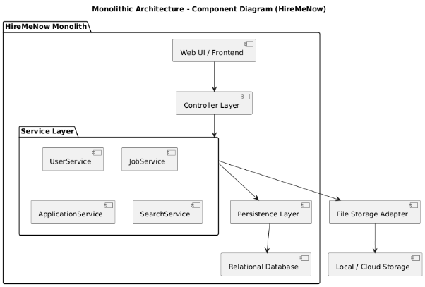
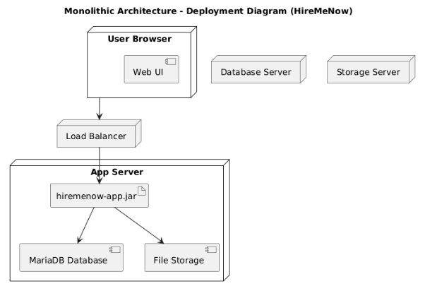
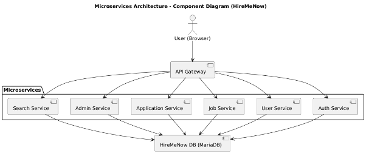
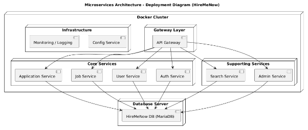
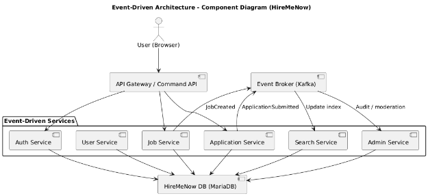
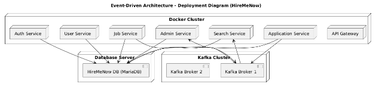

# Milestone 3 - Software Architectures

## 1) Monolithic Architecture

### 1.1 Description
A single deployable application (one JVM process or one web app) contains all modules:
- Presentation layer / Web UI
- Controller layer
- Service layer
- Persistence layer

Shared components: Authentication, Authorization, Validation, File storage (for portfolio files), Search (simple DB queries).

Data flow example (student applies):
- Browser → HTTP POST to /jobs/{id}/apply
- Controller calls ApplicationService (in same process)
- Service persists Application to single DB and returns success

Monolith is usually packaged as a single WAR/JAR and deployed to one or multiple identical instances behind a load balancer.

### 1.2 Component Diagram

### 1.3 Deployment Diagram

### 1.4 Pros (project-specific)
- Simple to develop and test: single codebase.
- Lower initial operational overhead: no service orchestration, no distributed tracing, easier to run locally (single DB + app).
- Faster to prototype: good for early milestones and demo.
- Easier debugging: stack traces and logs are in one place.

### 1.5 Cons (project-specific)
- Scalability limits: hard to scale individual components.
- Longer build/deploy cycles: any small change requires rebuilding and redeploying the whole app.
- Tight coupling: harder to adopt new tech for parts of the app without affecting all.
- Risk of monolith degeneration: codebase can become large and harder to maintain; harder to show advanced design patterns at runtime.

## 2) Microservices Architecture

### 2.1 Description
The system is split into small, independently deployable services. Example minimal split for HireMeNow:
- API Gateway
- Auth Service
- User Service
- Job Service
- Application Service
- Search Service
- Admin Service

Shared infrastructure: Config Service, Monitoring, Database.

Data flow (student applies):
- Frontend → API Gateway → Application Service REST call
- Application Service writes to its own database (or a shared schema, depending on setup)
- Application Service can emit an internal event to update analytics or search indexes asynchronously (not user notifications)

Two common database approaches:
- Database per service (true microservices, more complexity)
- Shared database with schema separation (simpler for student projects)

### 2.2 Component Diagram

### 2.3 Deployment Diagram

### 2.4 Pros (project-specific)
- Independent scaling: scale specific services separately.
- Team autonomy: each service can be developed and tested independently.
- Clear fault isolation: a failure in one service does not crash others.
- Technology flexibility: different languages or frameworks can be used per service.
- Aligns perfectly with Milestone 4 requirements (microservices + Docker + Postman testing).

### 2.5 Cons (project-specific)
- Higher complexity: requires inter-service communication and proper API versioning.
- More infrastructure: multiple containers, separate databases.
- Harder debugging: distributed logging and monitoring are needed.
- Data consistency challenges: may need compensation logic for related updates.

## 3) Event-Driven Architecture (EDA)
We chose Event-Driven Architecture as the third style. It differs from microservices because communication happens mainly through asynchronous events, rather than direct REST calls. This allows high decoupling and scalability, especially for background processes like analytics or search updates.

### 3.1 Description
Main idea: services publish and subscribe to events via a message broker. Services still exist (User, Job, Application, Search, Admin, Analytics), but interactions are event-based.

Example flows:
- Employer posts a job → Job Service publishes JobCreated event to Kafka.
- Search Service consumes JobCreated → updates search index.
- Analytics Service consumes JobCreated → updates platform statistics.
- Student applies to a job → Application Service publishes ApplicationSubmitted event.
- Analytics Service consumes it for tracking and reporting.
- Admin Service may log or audit the event.

Key components:
- Event Broker (Kafka cluster) — central system for events.
- Schema Registry (Avro/Protobuf) — ensures message compatibility.
- Lightweight Command/Query services (for direct actions or UI queries).
- Event Store (Kafka retains events for replay).
- Projections / Materialized views — consumers build read-optimized data for UI queries.

Data flow:
- Producers emit immutable events.
- Consumers process them asynchronously.
- The system becomes eventually consistent (updates propagate asynchronously).

### 3.2 Component Diagram

### 3.3 Deployment Diagram

### 3.4 Pros (project-specific)
- Extremely decoupled: new services can subscribe to events easily.
- Scalable: Kafka can handle very high throughput for background processing.
- Excellent auditability: all actions can be logged and replayed.
- Ideal for analytics and search updates.
- High performance for asynchronous tasks.

### 3.5 Cons (project-specific)
- Complex to implement and maintain (Kafka, Schema Registry, connectors).
- Eventual consistency can cause small data delays.
- Harder to test and debug event chains.
- Not ideal for a small student team due to setup overhead.

## 4) Comparison and final choice

### 4.1 Comparison table

| Criteria                        | Monolith     | Microservices | Event-Driven          |
|---------------------------------|--------------|---------------|-----------------------|
| Development complexity          | Low          | Medium–High   | High                  |
| Operational complexity          | Low          | High          | Very High             |
| Scalability (component-level)   | Poor         | Excellent     | Excellent (esp. event processing) |
| Fault isolation                 | Low          | High          | High                  |
| Suitability for course Milestone 4 | Medium    | High (required) | Medium–High (if combined with microservices) |
| Ease of testing                 | Easy         | Moderate      | Harder                |
| Learning / grading value        | Moderate     | High (shows advanced skills) | High (advanced, but risky) |
| Time to deliver                 | Short        | Longer        | Longest               |

### 4.2 Which architecture is most suitable for HireMeNow?
For our project, the microservices architecture is chosen because it provides the right combination of scalability, clarity of component separation, and direct compatibility with future milestones. It is complex enough to showcase solid design and implementation skills, yet feasible for a small development team to implement successfully using Docker and REST-based communication.
